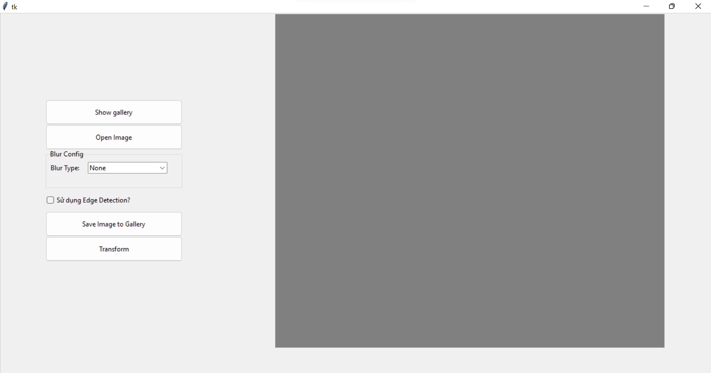
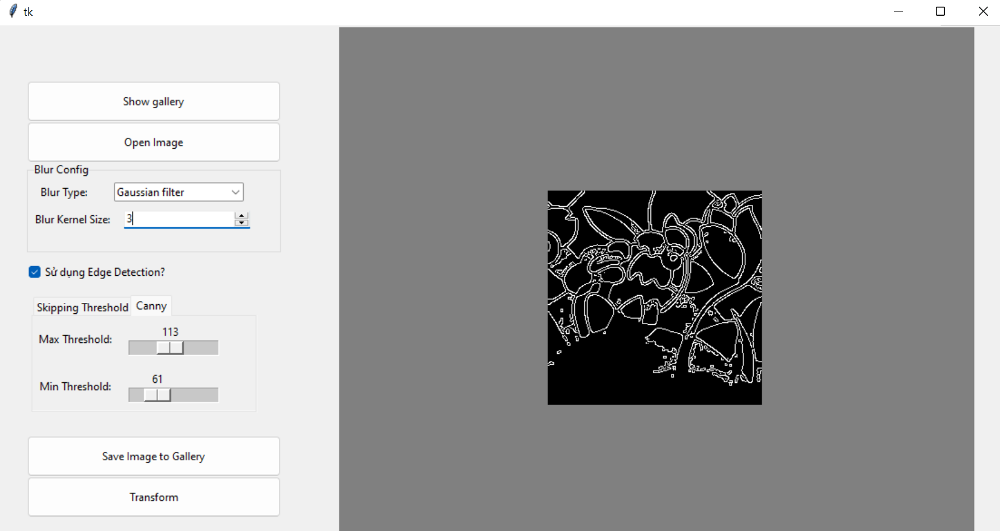
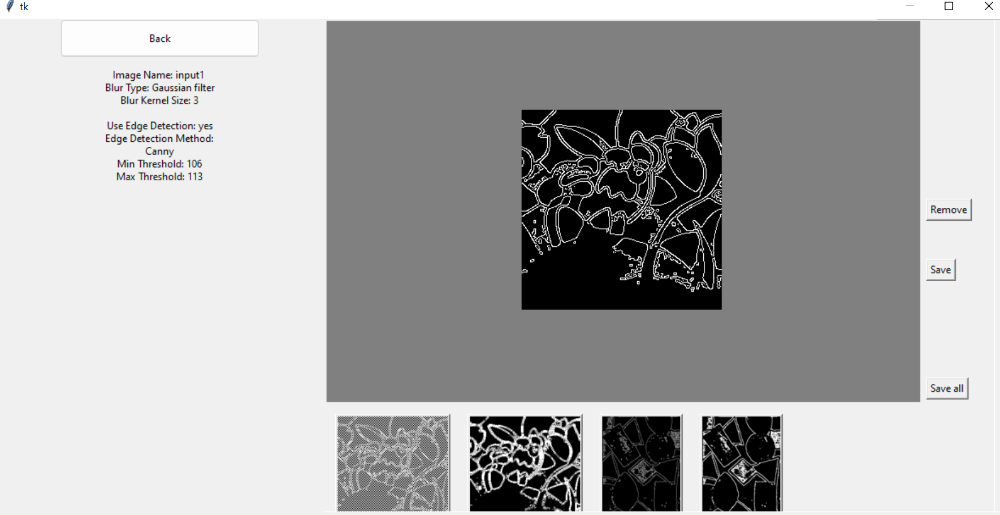

### Phần mềm phát hiện biên

### 1. Môi trường và ngôn ngữ lâp trình

\- Python 3.8

\- OpenCV

\- numpy==1.22.4

\- opencv-python==4.6.0.66

\- tk==0.1.0

### 2. Các chức năng của phần mềm

\- Thêm ảnh, hiển thị dạng canvas, chuyển ảnh sang đa mức xám

\- Làm trơn ảnh (smoothing) bằng các bộ lọc tùy chỉnh (mean, Gaussian)

\- Phát hiện biên bằng các bộ phát hiện biên Prewitt, Sobel, Canny,
Laplacian

\- Thư viện ảnh đã chỉnh sửa cho phép xem lại thông số và kết quả của bộ
phát hiện biên

\- Lưu ảnh kết quả ra file và thư mục

### 3. Qui trình cài đặt triển khai 

Cài đặt các gói thư viện yêu cầu sửa dụng câu lệnh

pip install -r requirement.txt

Sau khi cài đặt thành công thư viện ta tiến hành thực thi phần mềm bằng
câu lệnh:

python UI/main_program.py

Kết quả cài đặt là phần mềm là ứng dụng có giao diện:

### 4. Kịch bản kiểm thử các chức năng 

Chọn ảnh cần phát hiện biên, điều chỉnh các thuộc tính của bộ phát hiện
biên, phần mềm tự động cập nhật hình ảnh kết quả

Khi thay đổi các tham số (kích thước bộ lọc, giá trị threshold,...)
không hợp lệ sẽ nhận được các lỗi cảnh báo, ví dụ:

Sau khi chỉnh sửa ta thêm các kết quả vào thư viện và kiểm tra thuộc
tính, kiểm tra chức năng lưu file kết quả

